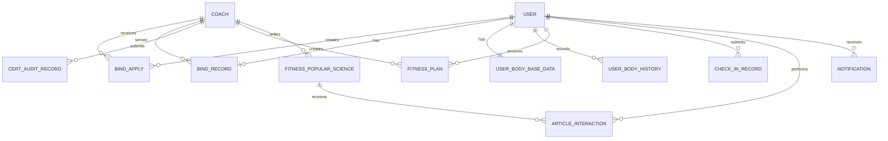

# 设计文档

## 概述

健身指导系统采用前后端分离的三层架构设计，前端使用Vue3 + Element Plus构建响应式用户界面，后端使用Spring Boot + MyBatis-Plus提供RESTful API服务，数据持久化使用MySQL 8.0。系统支持用户、教练、管理员三种角色，通过统一的认证授权机制实现权限控制。

系统核心业务流程包括：
1. 教练资质认证流程
2. 用户-教练绑定流程
3. 健身计划制定与审核流程
4. 日常打卡与反馈流程
5. 科普内容发布与管理流程

## 架构设计

### 整体架构

系统采用经典的三层架构模式：

```
┌─────────────────────────────────────────────────────────┐
│                    表现层 (Presentation)                  │
│              Vue3 + Element Plus + Axios                 │
└─────────────────────────────────────────────────────────┘
                            ↓ HTTP/HTTPS
┌─────────────────────────────────────────────────────────┐
│                    控制层 (Controller)                    │
│              Spring Boot REST Controllers                │
├─────────────────────────────────────────────────────────┤
│                    服务层 (Service)                       │
│              业务逻辑处理 + 事务管理                       │
├─────────────────────────────────────────────────────────┤
│                    数据层 (Repository)                    │
│              MyBatis-Plus + MySQL                        │
└─────────────────────────────────────────────────────────┘
```

### 技术栈选型

**前端技术栈：**
- Vue3: 渐进式JavaScript框架，提供响应式数据绑定
- Element Plus: 基于Vue3的UI组件库
- Axios: HTTP客户端，用于API调用
- Vue Router: 前端路由管理
- Pinia: 状态管理
- ECharts: 数据可视化图表库

**后端技术栈：**
- Spring Boot 2.7+: 简化Spring应用开发
- Sa-Token + JWT: 轻量级认证授权框架
- MyBatis-Plus: 增强的MyBatis持久层框架
- MySQL 8.0: 关系型数据库
- Lombok: 简化Java代码
- Hibernate Validator: 数据验证

## 组件与接口设计

### 前端组件结构

```
src/
├── views/                    # 页面组件
│   ├── user/                # 用户端页面
│   │   ├── Dashboard.vue    # 用户仪表盘
│   │   ├── CoachList.vue    # 教练列表
│   │   ├── Profile.vue      # 个人信息管理
│   │   ├── FitnessPlans.vue # 健身计划查看
│   │   ├── CheckIn.vue      # 每日打卡
│   │   └── Articles.vue     # 科普文章浏览
│   ├── coach/               # 教练端页面
│   │   ├── Dashboard.vue    # 教练仪表盘
│   │   ├── Students.vue     # 学员管理
│   │   ├── PlanEditor.vue   # 计划编辑器
│   │   ├── CheckInReview.vue # 打卡审阅
│   │   └── ArticleEditor.vue # 文章编辑器
│   ├── admin/               # 管理员端页面
│   │   ├── Dashboard.vue    # 管理仪表盘
│   │   ├── CoachAudit.vue   # 教练审核
│   │   ├── PlanAudit.vue    # 计划审核
│   │   └── ArticleAudit.vue # 文章审核
│   └── common/              # 公共页面
│       ├── Login.vue        # 登录页
│       └── Register.vue     # 注册页
├── components/              # 可复用组件
│   ├── BodyDataChart.vue    # 身体数据图表
│   ├── NotificationBell.vue # 通知铃铛
│   ├── FileUploader.vue     # 文件上传
│   └── AuditForm.vue        # 审核表单
├── api/                     # API接口封装
│   ├── auth.js              # 认证相关
│   ├── user.js              # 用户相关
│   ├── coach.js             # 教练相关
│   ├── plan.js              # 计划相关
│   ├── checkin.js           # 打卡相关
│   └── article.js           # 文章相关
├── store/                   # 状态管理
│   ├── user.js              # 用户状态
│   ├── notification.js      # 通知状态
│   └── app.js               # 应用状态
└── router/                  # 路由配置
    └── index.js
```

### 后端包结构

```
com.fitness.system/
├── controller/              # 控制器层
│   ├── AuthController       # 认证控制器
│   ├── UserController       # 用户控制器
│   ├── CoachController      # 教练控制器
│   ├── BindingController    # 绑定关系控制器
│   ├── PlanController       # 健身计划控制器
│   ├── CheckInController    # 打卡控制器
│   ├── ArticleController    # 科普文章控制器
│   └── NotificationController # 通知控制器
├── service/                 # 服务层
│   ├── AuthService          # 认证服务
│   ├── UserService          # 用户服务
│   ├── CoachService         # 教练服务
│   ├── BindingService       # 绑定服务
│   ├── PlanService          # 计划服务
│   ├── CheckInService       # 打卡服务
│   ├── ArticleService       # 文章服务
│   ├── NotificationService  # 通知服务
│   └── AuditService         # 审核服务
├── mapper/                  # 数据访问层
│   ├── UserMapper
│   ├── CoachProfileMapper
│   ├── CertAuditRecordMapper
│   ├── BindApplyMapper
│   ├── BindRecordMapper
│   ├── UserBodyBaseDataMapper
│   ├── UserBodyHistoryMapper
│   ├── FitnessPlanMapper
│   ├── CheckInRecordMapper
│   ├── FitnessPopularScienceMapper
│   ├── ArticleInteractionMapper
│   └── NotificationMapper
├── entity/                  # 实体类
│   ├── User
│   ├── CoachProfile
│   ├── CertAuditRecord
│   ├── BindApply
│   ├── BindRecord
│   ├── UserBodyBaseData
│   ├── UserBodyHistory
│   ├── FitnessPlan
│   ├── CheckInRecord
│   ├── FitnessPopularScience
│   ├── ArticleInteraction
│   └── Notification
├── dto/                     # 数据传输对象
│   ├── request/
│   │   ├── LoginRequest
│   │   ├── RegisterRequest
│   │   ├── CoachCertRequest
│   │   ├── BindApplyRequest
│   │   ├── PlanCreateRequest
│   │   ├── CheckInRequest
│   │   └── ArticleCreateRequest
│   └── response/
│       ├── LoginResponse
│       ├── UserInfoResponse
│       ├── CoachInfoResponse
│       └── StatisticsResponse
├── config/                  # 配置类
│   ├── SaTokenConfig        # Sa-Token配置
│   ├── MyBatisPlusConfig    # MyBatis-Plus配置
│   └── CorsConfig           # 跨域配置
├── security/                # 安全相关
│   ├── StpInterfaceImpl     # Sa-Token权限接口实现
│   └── SaTokenInterceptor   # Sa-Token拦截器
├── exception/               # 异常处理
│   ├── GlobalExceptionHandler # 全局异常处理器
│   └── BusinessException    # 业务异常
├── common/                  # 公共类
│   ├── Result               # 统一响应结果
│   ├── PageResult           # 分页结果
│   └── Constants            # 常量定义
└── util/                    # 工具类
    ├── PasswordEncoder      # 密码加密
    ├── FileUploadUtil       # 文件上传
    └── ValidationUtil       # 数据验证
```

### 核心接口定义

#### 认证接口

```java
POST /api/auth/register
Request: {
  username: string,
  password: string,
  email: string,
  phone: string,
  role: "USER" | "COACH"
}
Response: {
  code: number,
  message: string,
  data: { userId: number }
}

POST /api/auth/login
Request: {
  username: string,
  password: string
}
Response: {
  code: number,
  message: string,
  data: {
    token: string,      // Sa-Token生成的token
    userId: number,
    username: string,
    role: string
  }
}
```

#### 教练认证接口

```java
POST /api/coach/certification
Request: {
  coachId: number,
  certImages: string[],
  experience: string,
  specialties: string[],
  introduction: string
}
Response: {
  code: number,
  message: string,
  data: { auditId: number }
}

GET /api/coach/certification/status
Response: {
  code: number,
  data: {
    status: "PENDING" | "APPROVED" | "REJECTED",
    auditComment: string
  }
}
```

#### 用户信息接口

```java
POST /api/user/body-data
Request: {
  userId: number,
  height: number,
  weight: number,
  bodyFat: number,
  age: number,
  gender: "MALE" | "FEMALE"
}

POST /api/user/fitness-goal
Request: {
  userId: number,
  goalType: "LOSE_WEIGHT" | "GAIN_MUSCLE" | "SHAPE",
  targetWeight: number,
  targetDate: date,
  availableTime: string,
  exercisePreference: string[],
  intensity: "LOW" | "MEDIUM" | "HIGH",
  allergies: string[],
  restrictions: string[]
}
```

#### 绑定关系接口

```java
GET /api/coach/list
Response: {
  code: number,
  data: [{
    coachId: number,
    name: string,
    specialties: string[],
    studentCount: number,
    rating: number
  }]
}

POST /api/binding/apply
Request: {
  userId: number,
  coachId: number,
  message: string
}

POST /api/binding/approve
Request: {
  applyId: number,
  approved: boolean,
  replyMessage: string
}

DELETE /api/binding/unbind
Request: {
  bindingId: number
}
```

#### 健身计划接口

```java
POST /api/plan/create
Request: {
  userId: number,
  coachId: number,
  dietPlan: string,
  exercisePlan: string,
  duration: number,
  notes: string
}

GET /api/plan/list
Query: { userId: number }
Response: {
  code: number,
  data: [{
    planId: number,
    status: "PENDING" | "APPROVED" | "REJECTED" | "ACTIVE",
    createTime: datetime,
    dietPlan: string,
    exercisePlan: string
  }]
}

POST /api/plan/audit
Request: {
  planId: number,
  approved: boolean,
  auditComment: string
}
```

#### 打卡接口

```java
POST /api/checkin/submit
Request: {
  userId: number,
  date: date,
  exerciseCompletion: number,
  dietCompletion: number,
  weight: number,
  bodyFat: number,
  images: string[],
  notes: string
}

GET /api/checkin/history
Query: { userId: number, startDate: date, endDate: date }

POST /api/checkin/comment
Request: {
  checkinId: number,
  coachId: number,
  comment: string
}
```

#### 科普文章接口

```java
POST /api/article/create
Request: {
  coachId: number,
  title: string,
  content: string,
  category: "EXERCISE" | "DIET" | "RECOVERY" | "EQUIPMENT",
  coverImage: string
}

GET /api/article/list
Query: { category: string, page: number, size: number }

POST /api/article/interact
Request: {
  articleId: number,
  userId: number,
  type: "LIKE" | "FAVORITE"
}

POST /api/article/audit
Request: {
  articleId: number,
  approved: boolean,
  auditComment: string
}

PUT /api/article/manage
Request: {
  articleId: number,
  action: "OFFLINE" | "TOP" | "RECOMMEND"
}
```

#### 通知接口

```java
GET /api/notification/list
Query: { userId: number, unreadOnly: boolean }

PUT /api/notification/read
Request: { notificationId: number }

GET /api/notification/unread-count
Query: { userId: number }
```

## 数据模型

### 核心实体关系



### 实体类设计

#### User (用户表)

```java
@Entity
@Table(name = "user")
public class User {
    @Id
    @GeneratedValue(strategy = GenerationType.IDENTITY)
    private Long id;
    
    private String username;      // 用户名
    private String password;      // 加密密码
    private String email;         // 邮箱
    private String phone;         // 手机号
    private String role;          // 角色: USER, COACH, ADMIN
    private Integer status;       // 状态: 0-正常, 1-禁用
    private LocalDateTime createTime;
    private LocalDateTime updateTime;
}
```

#### CoachProfile (教练资料表)

```java
@Entity
@Table(name = "coach_profile")
public class CoachProfile {
    @Id
    @GeneratedValue(strategy = GenerationType.IDENTITY)
    private Long id;
    
    private Long userId;          // 关联用户ID
    private String certImages;    // 证书图片(JSON数组)
    private String experience;    // 教学履历
    private String specialties;   // 专业领域(JSON数组)
    private String introduction;  // 个人简介
    private Integer certStatus;   // 认证状态: 0-未认证, 1-待审核, 2-已认证, 3-已拒绝
    private Integer studentCount; // 学员数量
    private LocalDateTime createTime;
    private LocalDateTime updateTime;
}
```

#### UserBodyBaseData (用户基础身体数据表)

```java
@Entity
@Table(name = "t_user_body_base_data")
public class UserBodyBaseData {
    @Id
    @GeneratedValue(strategy = GenerationType.IDENTITY)
    private Long id;
    
    private Long userId;
    private BigDecimal height;        // 身高(cm)
    private BigDecimal weight;        // 体重(kg)
    private BigDecimal bodyFat;       // 体脂率(%)
    private Integer age;
    private String gender;            // MALE, FEMALE
    private String goalType;          // 目标类型
    private BigDecimal targetWeight;  // 目标体重
    private LocalDate targetDate;     // 期望达成日期
    private String availableTime;     // 可用时间段
    private String exercisePreference; // 运动偏好(JSON)
    private String intensity;         // 运动强度
    private String allergies;         // 过敏源(JSON)
    private String restrictions;      // 运动禁忌(JSON)
    private LocalDateTime createTime;
    private LocalDateTime updateTime;
}
```

#### BindRecord (绑定关系表)

```java
@Entity
@Table(name = "t_bind_record")
public class BindRecord {
    @Id
    @GeneratedValue(strategy = GenerationType.IDENTITY)
    private Long id;
    
    private Long userId;
    private Long coachId;
    private Integer status;       // 0-已绑定, 1-已解绑
    private LocalDateTime bindTime;
    private LocalDateTime unbindTime;
}
```

#### FitnessPlan (健身计划表)

```java
@Entity
@Table(name = "t_fitness_plan")
public class FitnessPlan {
    @Id
    @GeneratedValue(strategy = GenerationType.IDENTITY)
    private Long id;
    
    private Long userId;
    private Long coachId;
    private String dietPlan;      // 饮食方案
    private String exercisePlan;  // 运动计划
    private Integer duration;     // 计划周期(天)
    private String notes;         // 注意事项
    private Integer status;       // 0-待审核, 1-已通过, 2-已拒绝, 3-执行中
    private String auditComment;  // 审核意见
    private Integer version;      // 版本号
    private LocalDateTime createTime;
    private LocalDateTime auditTime;
}
```

#### CheckInRecord (打卡记录表)

```java
@Entity
@Table(name = "t_check_in_record")
public class CheckInRecord {
    @Id
    @GeneratedValue(strategy = GenerationType.IDENTITY)
    private Long id;
    
    private Long userId;
    private LocalDate checkInDate;
    private Integer exerciseCompletion;  // 运动完成度(0-100)
    private Integer dietCompletion;      // 饮食完成度(0-100)
    private BigDecimal weight;
    private BigDecimal bodyFat;
    private String images;               // 打卡图片(JSON数组)
    private String notes;                // 备注
    private String coachComment;         // 教练点评
    private LocalDateTime createTime;
    private LocalDateTime commentTime;
}
```

#### FitnessPopularScience (科普文章表)

```java
@Entity
@Table(name = "t_fitness_popular_science")
public class FitnessPopularScience {
    @Id
    @GeneratedValue(strategy = GenerationType.IDENTITY)
    private Long id;
    
    private Long coachId;
    private String title;
    private String content;
    private String category;      // EXERCISE, DIET, RECOVERY, EQUIPMENT
    private String coverImage;
    private Integer status;       // 0-待审核, 1-已发布, 2-已拒绝, 3-已下架
    private Integer viewCount;
    private Integer likeCount;
    private Integer favoriteCount;
    private Integer isTop;        // 是否置顶
    private Integer isRecommend;  // 是否推荐
    private String auditComment;
    private LocalDateTime createTime;
    private LocalDateTime publishTime;
}
```

#### Notification (通知表)

```java
@Entity
@Table(name = "t_notification")
public class Notification {
    @Id
    @GeneratedValue(strategy = GenerationType.IDENTITY)
    private Long id;
    
    private Long userId;
    private String type;          // BINDING, AUDIT, PLAN, COMMENT
    private String title;
    private String content;
    private Integer isRead;       // 0-未读, 1-已读
    private LocalDateTime createTime;
    private LocalDateTime readTime;
}
```

### 数据验证规则

**用户身体数据验证：**
- 身高: 50-250 cm
- 体重: 20-300 kg
- 体脂率: 5-60 %
- 年龄: 10-100 岁

**打卡数据验证：**
- 运动完成度: 0-100
- 饮食完成度: 0-100
- 每个用户每天只能提交一次打卡

**文件上传限制：**
- 图片格式: jpg, jpeg, png
- 单个文件大小: 最大5MB
- 视频格式: mp4, avi
- 单个视频大小: 最大50MB


## 正确性属性

*属性是一个特征或行为，应该在系统的所有有效执行中保持为真——本质上是关于系统应该做什么的形式化陈述。属性作为人类可读规范和机器可验证正确性保证之间的桥梁。*

### 属性 1: 审核状态转换的一致性

*对于任何* 审核记录（教练认证、健身计划、科普文章），当管理员执行审核操作时，状态转换应该是单向且不可逆的：待审核 → 已通过/已拒绝，且必须记录审核意见和审核时间。

**验证需求: 1.2, 1.3, 1.4, 4.3, 4.4, 4.5, 6.3, 6.4, 6.5**

### 属性 2: 审核历史记录的完整性

*对于任何* 可审核实体（教练认证、健身计划、科普文章），系统应该保留所有历史审核记录，且历史记录数量应该等于提交次数。

**验证需求: 1.6, 4.7**

### 属性 3: 教练认证状态与权限的一致性

*对于任何* 教练用户，只有当其认证状态为"已认证"时，才能出现在用户可见的教练列表中，且才能创建健身计划和科普文章。

**验证需求: 1.3, 3.1**

### 属性 4: 用户数据验证的边界检查

*对于任何* 用户提交的身体数据（身高、体重、体脂率、年龄），系统应该拒绝超出合理范围的数值，并保持原有数据不变。

**验证需求: 2.6**

### 属性 5: 身体数据历史记录的单调性

*对于任何* 用户的身体数据更新操作，系统应该创建新的历史记录，且历史记录的时间戳应该严格递增。

**验证需求: 2.5**

### 属性 6: 用户信息保存的完整性

*对于任何* 用户提交的基础信息（健身目标、运动偏好、健康限制），系统应该完整保存所有字段，且查询时返回的数据应该与提交的数据一致。

**验证需求: 2.2, 2.3, 2.4**

### 属性 7: 绑定关系的唯一性约束

*对于任何* 用户，在任意时刻最多只能有一个状态为"已绑定"的绑定记录，当尝试创建新绑定时，如果已存在有效绑定，系统应该拒绝该操作。

**验证需求: 3.6, 3.7**

### 属性 8: 绑定申请的状态转换

*对于任何* 绑定申请，当教练接受申请时，应该创建绑定关系记录并更新申请状态；当教练拒绝申请时，应该只更新申请状态而不创建绑定记录。

**验证需求: 3.3, 3.4**

### 属性 9: 绑定通知的触发一致性

*对于任何* 绑定相关操作（申请、接受、拒绝），系统应该创建相应的通知记录并发送给目标用户（教练或用户）。

**验证需求: 3.2, 7.1**

### 属性 10: 解绑操作的双向性

*对于任何* 有效的绑定关系，无论是用户还是教练发起解绑操作，系统都应该终止该绑定关系并更新状态为"已解绑"。

**验证需求: 3.5**

### 属性 11: 健身计划的版本管理

*对于任何* 已发布的健身计划，当教练进行调整时，系统应该创建新版本的计划记录（版本号递增），原版本记录保持不变，新版本重新进入待审核状态。

**验证需求: 4.6, 4.7**

### 属性 12: 计划审核通过后的通知推送

*对于任何* 健身计划，当审核状态从"待审核"变为"已通过"时，系统应该创建通知记录并发送给目标用户。

**验证需求: 4.4, 7.3**

### 属性 13: 计划数据完整性验证

*对于任何* 健身计划提交请求，如果缺少必填字段（饮食方案、运动计划、计划周期），系统应该拒绝该请求并返回验证错误。

**验证需求: 4.1**

### 属性 14: 打卡记录的唯一性约束

*对于任何* 用户和日期组合，系统应该最多只允许存在一条打卡记录，当尝试在同一天提交第二次打卡时，系统应该拒绝该操作。

**验证需求: 5.7**

### 属性 15: 打卡数据的完成度范围验证

*对于任何* 打卡记录，运动完成度和饮食完成度的值应该在0-100范围内，超出范围的值应该被拒绝。

**验证需求: 5.1**

### 属性 16: 打卡通知的自动触发

*对于任何* 用户提交的打卡记录，系统应该自动创建通知并发送给该用户当前绑定的教练。

**验证需求: 5.3, 7.4**

### 属性 17: 教练点评的关联性

*对于任何* 教练对打卡记录的点评操作，系统应该验证该教练与打卡用户存在有效的绑定关系，否则拒绝点评操作。

**验证需求: 5.5, 10.3**

### 属性 18: 身体数据趋势的时间序列完整性

*对于任何* 用户的身体数据查询请求，系统应该返回按时间排序的完整历史记录，包括初始数据和所有打卡记录中的数据。

**验证需求: 5.6, 9.5**

### 属性 19: 科普文章的审核状态过滤

*对于任何* 用户浏览科普文章的请求，系统应该只返回状态为"已发布"的文章，待审核、已拒绝、已下架的文章不应该出现在列表中。

**验证需求: 6.6**

### 属性 20: 文章互动的统计一致性

*对于任何* 科普文章，其点赞数和收藏数应该等于对应互动记录表中该文章的点赞记录数和收藏记录数。

**验证需求: 6.7**

### 属性 21: 文章管理操作的权限验证

*对于任何* 文章管理操作（下架、置顶、推荐），系统应该验证操作者具有管理员角色，否则拒绝该操作。

**验证需求: 6.8**

### 属性 22: 通知状态的单向转换

*对于任何* 通知记录，当用户查看通知时，状态应该从"未读"变为"已读"，且该转换是单向的（已读不能变回未读）。

**验证需求: 7.5**

### 属性 23: 通知保留期限的自动清理

*对于任何* 用户的通知记录，系统应该只保留最近30天的记录，超过30天的通知应该被自动清理。

**验证需求: 7.6**

### 属性 24: 未读通知计数的准确性

*对于任何* 用户，其未读通知数量应该等于该用户所有状态为"未读"的通知记录数。

**验证需求: 7.7**

### 属性 25: 用户注册的必填字段验证

*对于任何* 用户注册请求，如果缺少必填字段（用户名、密码、邮箱、手机号），系统应该拒绝该请求并返回验证错误。

**验证需求: 8.1**

### 属性 26: 登录凭证的验证正确性

*对于任何* 登录请求，只有当用户名存在且密码匹配时，系统才应该返回成功响应和JWT令牌；否则应该返回认证失败错误。

**验证需求: 8.2**

### 属性 27: Sa-Token令牌的角色信息一致性

*对于任何* 成功的登录操作，Sa-Token中存储的角色信息应该与数据库中该用户的角色字段一致。

**验证需求: 8.3**

### 属性 28: 基于角色的访问控制

*对于任何* API请求，系统应该根据用户角色验证访问权限：普通用户只能访问用户功能，教练只能访问教练功能和已绑定用户的数据，管理员可以访问所有审核和管理功能。

**验证需求: 8.4, 8.5, 8.6, 8.7**

### 属性 29: 会话过期的强制重新认证

*对于任何* 携带过期Sa-Token令牌的请求，系统应该拒绝该请求并返回401未授权错误，要求用户重新登录。

**验证需求: 8.8**

### 属性 30: 教练学员列表的绑定关系过滤

*对于任何* 教练查询学员列表的请求，系统应该只返回与该教练存在有效绑定关系（状态为"已绑定"）的用户信息。

**验证需求: 9.1**

### 属性 31: 打卡统计的计算准确性

*对于任何* 用户的打卡统计查询，打卡率应该等于（实际打卡天数 / 计划周期天数）× 100%，计划完成度应该等于所有打卡记录的平均完成度。

**验证需求: 9.3**

### 属性 32: 密码的加密存储

*对于任何* 用户注册或密码修改操作，数据库中存储的密码字段应该是加密后的哈希值，而不是明文密码。

**验证需求: 10.1**

### 属性 33: 数据访问的绑定关系验证

*对于任何* 教练访问用户健康数据的请求，系统应该验证该教练与目标用户存在有效的绑定关系，否则拒绝访问。

**验证需求: 10.2, 10.3**

### 属性 34: 解绑后的权限撤销

*对于任何* 解绑操作，执行后教练应该立即失去对该用户数据的访问权限，后续访问请求应该被拒绝。

**验证需求: 10.4**

### 属性 35: 敏感操作的审计日志记录

*对于任何* 敏感数据访问操作（查看用户健康数据、修改用户信息），系统应该创建审计日志记录，包含操作者、操作时间、操作类型等信息。

**验证需求: 10.5**

## 错误处理

### 异常分类

系统定义以下异常类型：

1. **业务异常 (BusinessException)**
   - 绑定关系已存在
   - 每日打卡已提交
   - 教练未认证
   - 无权限访问

2. **验证异常 (ValidationException)**
   - 必填字段缺失
   - 数据格式错误
   - 数值超出范围

3. **认证异常 (AuthenticationException)**
   - 用户名或密码错误
   - Sa-Token令牌无效或过期
   - 未登录

4. **授权异常 (AuthorizationException)**
   - 角色权限不足
   - 无绑定关系

5. **资源异常 (ResourceException)**
   - 用户不存在
   - 记录不存在
   - 文件上传失败

### 统一错误响应格式

```json
{
  "code": 400,
  "message": "业务错误描述",
  "data": null,
  "timestamp": "2024-01-01T12:00:00"
}
```

### 错误码定义

- 200: 成功
- 400: 业务错误
- 401: 未认证
- 403: 无权限
- 404: 资源不存在
- 500: 服务器内部错误

### 错误处理策略

1. **前端错误处理**
   - 使用Axios拦截器统一处理HTTP错误
   - 根据错误码显示相应的用户提示
   - 401错误自动跳转到登录页
   - 表单验证错误在字段下方显示

2. **后端错误处理**
   - 使用@ControllerAdvice全局异常处理器
   - 捕获所有异常并转换为统一响应格式
   - 记录错误日志（包含堆栈信息）
   - 敏感信息不暴露给前端

3. **数据库错误处理**
   - 唯一约束冲突转换为业务异常
   - 外键约束冲突提示关联数据存在
   - 事务回滚确保数据一致性

## 测试策略

### 测试方法

系统采用**双重测试方法**：单元测试和基于属性的测试相结合，确保全面的代码覆盖和正确性验证。

**单元测试**用于验证：
- 特定的业务场景示例
- 边界条件和边缘情况
- 错误处理逻辑
- 组件之间的集成点

**基于属性的测试**用于验证：
- 通用的业务规则在所有输入下都成立
- 数据一致性和完整性约束
- 状态转换的正确性
- 通过随机化实现全面的输入覆盖

两种测试方法是互补的：单元测试捕获具体的错误，基于属性的测试验证通用的正确性。

### 测试框架选择

**后端测试：**
- JUnit 5: 单元测试框架
- Mockito: Mock对象框架
- jqwik: Java的基于属性测试库
- Spring Boot Test: 集成测试支持
- H2 Database: 内存数据库用于测试

**前端测试：**
- Vitest: Vue3测试框架
- Vue Test Utils: Vue组件测试工具
- fast-check: JavaScript的基于属性测试库

### 基于属性的测试配置

- 每个属性测试最少运行**100次迭代**（由于随机化）
- 每个测试必须使用注释标签引用设计文档中的属性
- 标签格式: `@Property("Feature: fitness-guidance-system, Property {number}: {property_text}")`
- 每个正确性属性必须由**单个**基于属性的测试实现

### 测试覆盖目标

- 服务层代码覆盖率: ≥ 80%
- 控制器层代码覆盖率: ≥ 70%
- 关键业务逻辑覆盖率: 100%

### 测试用例设计

#### 单元测试示例

```java
// 测试教练认证审核通过场景
@Test
void testCoachCertificationApproval() {
    // Given: 创建待审核的教练认证记录
    CertAuditRecord record = createPendingCertRecord();
    
    // When: 管理员审核通过
    auditService.approveCertification(record.getId(), "资质符合要求");
    
    // Then: 验证状态更新和通知发送
    CertAuditRecord updated = certAuditRecordMapper.selectById(record.getId());
    assertEquals(CertStatus.APPROVED, updated.getStatus());
    assertNotNull(updated.getAuditComment());
    
    // 验证教练状态更新
    CoachProfile coach = coachProfileMapper.selectByUserId(record.getUserId());
    assertEquals(CertStatus.APPROVED, coach.getCertStatus());
    
    // 验证通知创建
    List<Notification> notifications = notificationMapper.selectByUserId(record.getUserId());
    assertTrue(notifications.stream()
        .anyMatch(n -> n.getType().equals("AUDIT") && n.getContent().contains("通过")));
}

// 测试绑定唯一性约束
@Test
void testUserCanOnlyBindOneCoach() {
    // Given: 用户已绑定教练A
    Long userId = 1L;
    Long coachAId = 2L;
    Long coachBId = 3L;
    bindingService.createBinding(userId, coachAId);
    
    // When: 尝试绑定教练B
    // Then: 应该抛出业务异常
    assertThrows(BusinessException.class, () -> {
        bindingService.createBinding(userId, coachBId);
    });
}

// 测试打卡数据验证
@Test
void testCheckInDataValidation() {
    CheckInRequest request = new CheckInRequest();
    request.setUserId(1L);
    request.setExerciseCompletion(150); // 超出范围
    request.setDietCompletion(50);
    
    // 应该抛出验证异常
    assertThrows(ValidationException.class, () -> {
        checkInService.submitCheckIn(request);
    });
}
```

#### 基于属性的测试示例

```java
// 属性1: 审核状态转换的一致性
@Property
@Label("Feature: fitness-guidance-system, Property 1: 审核状态转换的一致性")
void auditStatusTransitionConsistency(@ForAll("pendingAuditRecords") CertAuditRecord record,
                                      @ForAll boolean approved,
                                      @ForAll String comment) {
    // Given: 任意待审核记录
    Long recordId = certAuditRecordMapper.insert(record);
    
    // When: 执行审核操作
    if (approved) {
        auditService.approveCertification(recordId, comment);
    } else {
        auditService.rejectCertification(recordId, comment);
    }
    
    // Then: 验证状态转换和审核信息记录
    CertAuditRecord updated = certAuditRecordMapper.selectById(recordId);
    CertStatus expectedStatus = approved ? CertStatus.APPROVED : CertStatus.REJECTED;
    
    assertEquals(expectedStatus, updated.getStatus());
    assertEquals(comment, updated.getAuditComment());
    assertNotNull(updated.getAuditTime());
}

// 属性7: 绑定关系的唯一性约束
@Property
@Label("Feature: fitness-guidance-system, Property 7: 绑定关系的唯一性约束")
void bindingUniquenessConstraint(@ForAll("users") User user,
                                 @ForAll("coaches") Coach coach1,
                                 @ForAll("coaches") Coach coach2) {
    Assume.that(!coach1.getId().equals(coach2.getId()));
    
    // Given: 用户已绑定教练1
    bindingService.createBinding(user.getId(), coach1.getId());
    
    // When: 尝试绑定教练2
    // Then: 应该被拒绝
    assertThrows(BusinessException.class, () -> {
        bindingService.createBinding(user.getId(), coach2.getId());
    });
    
    // 验证只有一个有效绑定
    List<BindRecord> bindings = bindRecordMapper.selectActiveByUserId(user.getId());
    assertEquals(1, bindings.size());
    assertEquals(coach1.getId(), bindings.get(0).getCoachId());
}

// 属性14: 打卡记录的唯一性约束
@Property
@Label("Feature: fitness-guidance-system, Property 14: 打卡记录的唯一性约束")
void checkInDailyUniqueness(@ForAll("users") User user,
                           @ForAll("checkInData") CheckInRequest request1,
                           @ForAll("checkInData") CheckInRequest request2) {
    LocalDate today = LocalDate.now();
    request1.setUserId(user.getId());
    request1.setDate(today);
    request2.setUserId(user.getId());
    request2.setDate(today);
    
    // Given: 用户今天已打卡
    checkInService.submitCheckIn(request1);
    
    // When: 尝试再次打卡
    // Then: 应该被拒绝
    assertThrows(BusinessException.class, () -> {
        checkInService.submitCheckIn(request2);
    });
    
    // 验证只有一条记录
    List<CheckInRecord> records = checkInRecordMapper
        .selectByUserIdAndDate(user.getId(), today);
    assertEquals(1, records.size());
}

// 属性32: 密码的加密存储
@Property
@Label("Feature: fitness-guidance-system, Property 32: 密码的加密存储")
void passwordEncryptionStorage(@ForAll("registerRequests") RegisterRequest request) {
    // When: 用户注册
    Long userId = authService.register(request);
    
    // Then: 数据库中的密码应该是加密的
    User user = userMapper.selectById(userId);
    
    // 密码不应该是明文
    assertNotEquals(request.getPassword(), user.getPassword());
    
    // 密码应该是BCrypt格式（以$2a$开头）
    assertTrue(user.getPassword().startsWith("$2a$"));
    
    // 应该能够验证密码
    assertTrue(passwordEncoder.matches(request.getPassword(), user.getPassword()));
}

// 数据生成器
@Provide
Arbitrary<CertAuditRecord> pendingAuditRecords() {
    return Combinators.combine(
        Arbitraries.longs().between(1L, 1000L),
        Arbitraries.strings().alpha().ofLength(10),
        Arbitraries.strings().ofLength(100)
    ).as((userId, certImages, experience) -> {
        CertAuditRecord record = new CertAuditRecord();
        record.setUserId(userId);
        record.setCertImages(certImages);
        record.setExperience(experience);
        record.setStatus(CertStatus.PENDING);
        return record;
    });
}

@Provide
Arbitrary<User> users() {
    return Combinators.combine(
        Arbitraries.strings().alpha().ofMinLength(5).ofMaxLength(20),
        Arbitraries.strings().alpha().ofMinLength(8),
        Arbitraries.emails()
    ).as((username, password, email) -> {
        User user = new User();
        user.setUsername(username);
        user.setPassword(password);
        user.setEmail(email);
        user.setRole("USER");
        return userMapper.insert(user);
    });
}
```

### 集成测试

```java
@SpringBootTest
@AutoConfigureMockMvc
class FitnessSystemIntegrationTest {
    
    @Autowired
    private MockMvc mockMvc;
    
    @Test
    void testCompleteBindingWorkflow() throws Exception {
        // 1. 用户注册
        String userToken = registerAndLogin("user1", "USER");
        
        // 2. 教练注册并认证
        String coachToken = registerAndLogin("coach1", "COACH");
        submitCoachCertification(coachToken);
        
        // 3. 管理员审核通过
        String adminToken = loginAsAdmin();
        approveCoachCertification(adminToken);
        
        // 4. 用户发起绑定申请
        Long applyId = createBindingApply(userToken);
        
        // 5. 教练接受申请
        approveBindingApply(coachToken, applyId);
        
        // 6. 验证绑定关系建立
        mockMvc.perform(get("/api/binding/status")
                .header("Authorization", "Bearer " + userToken))
                .andExpect(status().isOk())
                .andExpect(jsonPath("$.data.bound").value(true));
    }
}
```

### 前端测试

```javascript
// 组件单元测试
import { mount } from '@vue/test-utils'
import CheckInForm from '@/components/CheckInForm.vue'

describe('CheckInForm', () => {
  it('should validate completion range', async () => {
    const wrapper = mount(CheckInForm)
    
    // 输入超出范围的值
    await wrapper.find('#exerciseCompletion').setValue(150)
    await wrapper.find('form').trigger('submit')
    
    // 应该显示验证错误
    expect(wrapper.find('.error-message').text())
      .toContain('完成度应在0-100之间')
  })
  
  it('should prevent duplicate check-in', async () => {
    const wrapper = mount(CheckInForm, {
      props: { hasCheckedInToday: true }
    })
    
    // 提交按钮应该被禁用
    expect(wrapper.find('button[type="submit"]').attributes('disabled'))
      .toBeDefined()
  })
})

// 基于属性的测试
import fc from 'fast-check'

describe('Body Data Validation', () => {
  it('should reject out-of-range values', () => {
    fc.assert(
      fc.property(
        fc.oneof(
          fc.double({ min: -1000, max: 49.9 }),  // 身高过低
          fc.double({ min: 250.1, max: 1000 })   // 身高过高
        ),
        (height) => {
          const result = validateBodyData({ height })
          expect(result.valid).toBe(false)
          expect(result.errors).toContain('height')
        }
      ),
      { numRuns: 100 }
    )
  })
})
```

### 测试数据管理

使用测试数据构建器模式创建测试数据：

```java
public class TestDataBuilder {
    
    public static User.UserBuilder aUser() {
        return User.builder()
            .username("testuser" + System.currentTimeMillis())
            .password("password123")
            .email("test@example.com")
            .phone("13800138000")
            .role("USER")
            .status(0);
    }
    
    public static CoachProfile.CoachProfileBuilder aCoachProfile() {
        return CoachProfile.builder()
            .certImages("[\"cert1.jpg\"]")
            .experience("5年健身教练经验")
            .specialties("[\"减脂\",\"增肌\"]")
            .introduction("专业健身教练")
            .certStatus(CertStatus.PENDING)
            .studentCount(0);
    }
    
    public static CheckInRequest.CheckInRequestBuilder aCheckInRequest() {
        return CheckInRequest.builder()
            .date(LocalDate.now())
            .exerciseCompletion(80)
            .dietCompletion(90)
            .weight(new BigDecimal("70.5"))
            .bodyFat(new BigDecimal("18.5"))
            .notes("今天状态不错");
    }
}
```

### 持续集成

- 所有测试在每次代码提交时自动运行
- 测试失败阻止代码合并
- 生成测试覆盖率报告
- 基于属性的测试失败时保存反例用于回归测试
